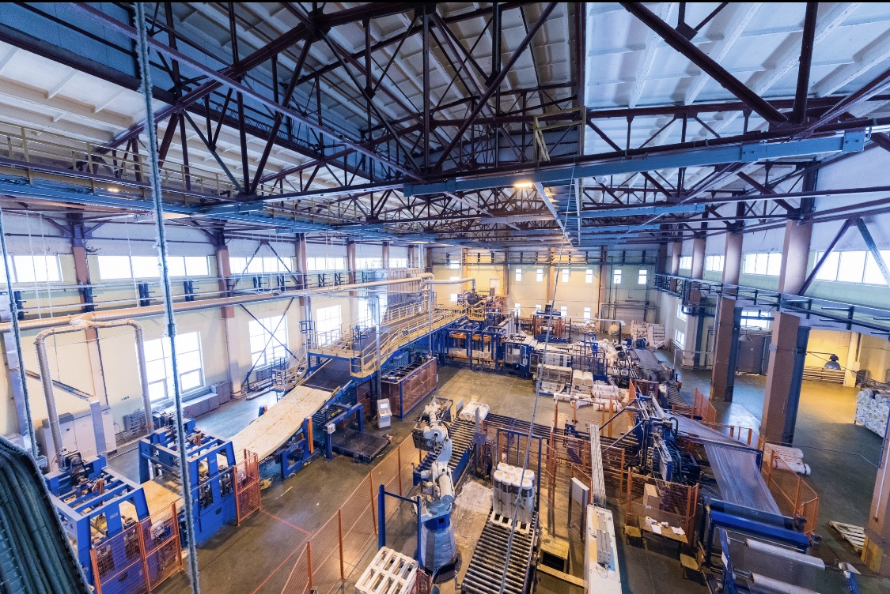
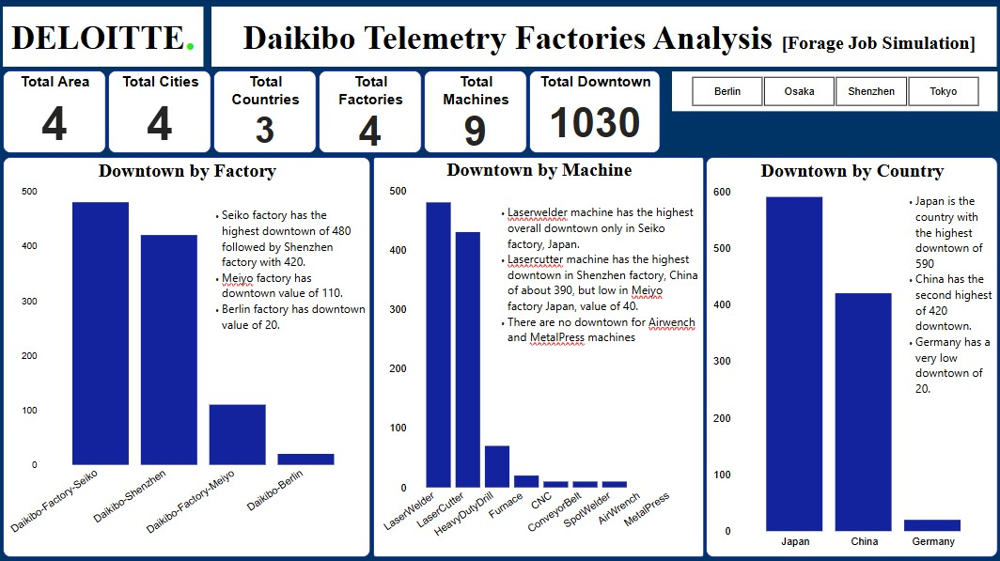

# Daikibo Telemetry Factory Analysis [Deloitte Job Simulation]

## Introduction 
The project is a job simulation data from Forage website sponsored by Deloitte Australia. The project focused on analyzes of nine (9) machine downtime across four factories located in Japan, China, and Germany. 

## Problem Statement
Through the dataset, we aim to gain insight into the following;
- Factory with the highest machine downtown.
- Machines with the highest downtown.
-  Country with the highest machine downtown.
  
The overall goal is to identify key areas of inefficiency and potential improvement based on machine and location-specific downtime data.

## Skills and Expertise
* Understanding Data: Understanding the data set, the data types, in order to identify errors, and the problems.
* Data Cleaning & Transformation: With the use of Power Query editor in powerbi, the dataset was transformed from json to table format and cleaned by changing to appriprate data types, and changing the fonts to ensure consistency in values.
* Data Analysis: Using statistical methods, and business intelligence techniques to calculate for the downtown using DAX functions, identify key KPIs, trends, and pattern.
* Data Visualization: Using appropriate charts and cards to visualize the analysis for clear insight through the use of PowerBI.
* Insight Analysis: Understanding the findings and visuals to evaluate...
Report Writing & Presentation: Summarizing findings, explaining insights and providing recommendations in a structured professional format. The skills and expertise ensured a thorough and insightful analysis into the performance ories and machines.

## Data Modelling 

## Analysis & Insights
#### Factory Level Summary
* Seiko Factory (Osaka, Japan)
Records the highest total downtime among all factories. Downtime is solely attributed to the Laser Welder machine, with approximately 480 minutes.
* Shenzhen Factory (China) recorded the Second-highest overall downtime. The Laser Cutter experiences significant downtime.
Other machines (CNC, conveyobject, SpotWelder) show equal and very low downtime.
* Meiyo Factory (Japan) Exhibits low overall downtime. Two machines (Laser Cutter and HeavyDuty Drill) are affected, with the drill having slightly higher downtime.
* Berlin Factory (Germany)
Records the lowest total downtime at just 20 minutes.
Only the Furnace machine is affected.

#### Machine Level Summary
* Laser Welder: Highest downtime overall, driven by Seiko Factory in Japan.
* Laser Cutter: Second-highest downtown with issues observed in both Shenzhen and Meiyo factories.
* HeavyDuty Drill: Minor downtime reported only in Meiyo.
* Furnace: Minimal impact, only in Berlin.
Air Wrench & Metal Press: Show no significant downtime across all factories.

#### Downtime by Country
* Japan: Highest cumulative downtime, primarily due to the Laser Welder at Seiko Factory at 480 minutes.
* China: Second highest downtime, led by the Laser Cutter at Shenzhen Factory.
* Germany: Lowest downtime, limited to a single instance at the Berlin Factory at 20 minutes. 

##### Summary
The Seiko Factory is located exclusively in Osaka, Japan, and has the most critical machine issue (Laser Welder).

Laser Welder is the only machine contributing the most downtime.

Air Wrench and Metal Press machines performed optimally across all factories, with no recorded downtime.

##### _Note: The data recorded the highest downtown in Japan and China relating to specific  machines. This raise the possibility that certain machine may not be fully optimize based on climate condition. it is recommended to conduct further research to understand if there is a relationship._

## Recommendations
* Focus should be on machines with high downtime. The Laser Welder at Seiko Factory and the Laser Cutter at Shenzhen and Meiyo Factories should be the primary focus, as they contribute the most to overall downtime.
* Investigation should be carried out to identify underlying issues for recurring downtime in high impact machines. such as machine management issue, operation error, sofware or hardware problem. Equipment condition review to identify the need for upgrade or replacement of faulty machine part.
* Investigation should be carrier out in Berlin Factory for practies in maintainance, operations, and manpower training to identify strategies that can be replicate in other factories.
* Freqent training program should be introduced for continuous improvement of operator's knowledge and skills in handling machines as inconsistent handling or lack of knowledge may contribute to the rate of downtime.

## Strategic Actions
* Develop and implement preventive maintenance plans for high downtown machines.
* Routine inspections and servicing for all high downtime machines should be scheduled to prevent unexpected breakdowns.
* Launch frequent training for operators and technicians to increase their knowledge in machine operations.
* Create a Best Practice handbook to ensure consistency in operation.
* Document successful operational and maintenance procedures ans sratefies from the Berlin Factory and implement them in other factories.
* Perform technical assessments of machines with persistent issues and prioritize upgrades or replacements where cost-effective.

## Final Thought
The analysis on machine downtown has provided valuable insights into performance and operational inefficiencies across multiple factory locations. It is clear that specific machines in specific countries are the significant contributors to downtime. 

These high-impact issues can be addressed to enhance overall performance through targeted maintenance, training and development, adequate supervision, equipment upgrades, strategic process improvements, and replication of practices from low downtown factory. 
